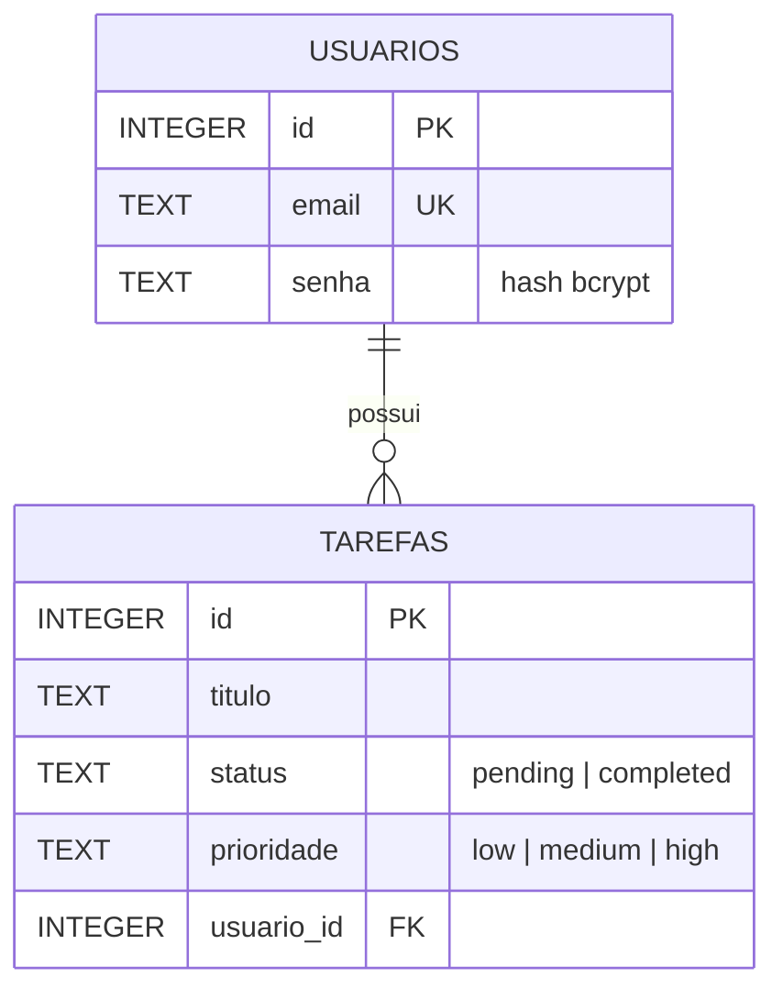
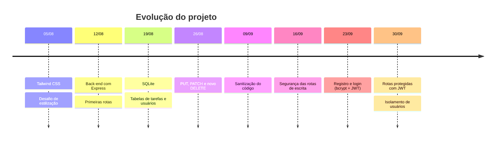

<div align="center">

# Gerenciador de Tarefas Multi-Usuário

**Disciplina de Desenvolvimento de Sistemas Web**

API REST para gerenciamento de tarefas com autenticação, persistência em SQLite e front-end estilizado com Tailwind CSS.


**Estudante:** Thiago Borsatto Dutra

[Objetivo](#objetivo) •
[Como rodar](#como-rodar) •
[Endpoints](#endpoints-da-api) •
[Estrutura](#estrutura-do-projeto) •
[Diário de aulas](#diário-de-aulas) •
[Semanário](#semanário)

</div>

---

## Objetivo

Desenvolver um **gerenciador de tarefas completo e multi-usuário**, persistindo os dados em **SQLite**, aplicando boas práticas de segurança: validação de entradas, consultas parametrizadas, tratamento de erros sem vazamento de informações e autenticação com **bcrypt + JWT**.

## Funcionalidades

| | Recurso | Descrição |
|:-:|---|---|
| ▸ | **CRUD de tarefas** | Criar, listar, buscar, atualizar (total e parcial) e excluir tarefas |
| ▸ | **Busca por título** | `GET /api/tasks?search=termo` com proteção contra SQL Injection |
| ▸ | **Validação centralizada** | Helpers (`tituloValido`, `normalizarPrioridade`, `parsearId`...) reutilizados por todas as rotas |
| ▸ | **Registro e login** | Senhas guardadas como hash (bcrypt) e login que devolve um token JWT válido por 2h |
| ▸ | **Rotas protegidas** | Todas as rotas de tarefas exigem o token JWT (middleware `authenticate`) |
| ▸ | **Isolamento de usuários** | Cada usuário só vê e altera as próprias tarefas (`usuario_id`) |
| ▸ | **PATCH atômico** | Atualizações parciais dentro de uma transação do SQLite |
| ▸ | **Erros padronizados** | `400` validação · `401` credenciais/token · `404` não encontrado · `409` conflito · `500` erro interno genérico |

---

## Como rodar

### Pré-requisitos

- [Node.js](https://nodejs.org/) instalado
- Extensão [REST Client](https://marketplace.visualstudio.com/items?itemName=humao.rest-client) no VS Code (para os testes)

### Passo a passo

```bash
# 1. Instale as dependências (rode na pasta onde está o package.json!)
npm install

# 2. Suba o servidor em modo desenvolvimento (reinicia ao salvar)
npm run dev
```

O servidor sobe em **http://localhost:3000** e o banco `tarefas.db` é criado automaticamente.

### Scripts disponíveis

| Comando | O que faz |
|---|---|
| `npm run dev` | Inicia o servidor com *hot reload* (`tsx watch`) |
| `npm start` | Inicia o servidor sem *watch* |
| `npm run build` | Checagem de tipos com o TypeScript (`tsc`) |

### Variáveis de ambiente

| Variável | Padrão | Descrição |
|---|---|---|
| `PORT` | `3000` | Porta do servidor |
| `JWT_SECRET` | `super_secreto_desenvolvimento` | Chave de assinatura dos tokens — **troque em produção!** |

---

## Endpoints da API

### Diagnóstico

| Método | Rota | Descrição |
|:-:|---|---|
|  | `/` | Rota de *fallback* |
|  | `/api/health` | Verifica se o servidor está ativo |
|  | `/api/version` | Nome e versão do sistema |

### Autenticação

| Método | Rota | Corpo | Respostas |
|:-:|---|---|---|
|  | `/api/auth/register` | `{ "email", "senha" }` | `201` · `400` · `409` |
|  | `/api/auth/login` | `{ "email", "senha" }` | `200 { token }` · `400` · `401` |

### Tarefas

> [!IMPORTANT]
> Todas as rotas de tarefas exigem o cabeçalho `Authorization: Bearer <token>` (token gerado no login). Sem token, ou com token inválido/expirado, a resposta é `401`. Tarefas de outro usuário respondem `404`.

| Método | Rota | Corpo | Respostas |
|:-:|---|---|---|
|  | `/api/tasks?search=` | — | `200` · `401` · `500` |
|  | `/api/tasks` | `{ "titulo", "prioridade" }` | `201` · `400` · `401` · `500` |
|  | `/api/tasks/:id` | `{ "titulo", "prioridade", "status" }` | `200` · `400` · `401` · `404` · `500` |
|  | `/api/tasks/:id` | qualquer campo acima | `200` · `400` · `401` · `404` · `500` |
|  | `/api/tasks/:id` | — | `200` · `400` · `401` · `404` · `500` |

> [!NOTE]
> **Regras de validação**
> - `titulo`: texto com **pelo menos 3 caracteres** (espaços nas pontas são ignorados)
> - `prioridade`: `low` · `medium` · `high` (padrão: `medium`)
> - `status`: `pending` · `completed` (padrão: `pending`)
> - `senha`: **pelo menos 6 caracteres**

### Testando com o REST Client

Todos os cenários de teste estão em [`requests.http`](requests.http). Para usar:

1. Crie um arquivo com extensão **`.http`** ou **`.rest`**
2. Separe cada requisição com **`###`** — sem isso o REST Client não reconhece as requisições
3. Use variáveis para facilitar a manutenção:

```http
@baseUrl = http://localhost:3000

### Listar todas as tarefas
GET {{baseUrl}}/api/tasks
```

> [!TIP]
> Cuidado com comentários colados logo abaixo da linha da requisição: o REST Client pode interpretá-los como *header* e o teste deixa de funcionar.

---

## Estrutura do projeto

```text
gerenciador-de-tarefas/
├── Semanario/              # Registros semanais de aprendizado
├── server.ts               # API Express + SQLite + autenticação
├── requests.http           # Cenários de teste (REST Client)
├── index.html              # Front-end do gerenciador de tarefas
├── index.txt               # Código original da aula 1 (backup)
├── tailwindCSS.html        # Estudo das classes básicas do Tailwind
├── Desafio_aulas_3e4.html  # Desafio de estilização com Tailwind
├── tailwind.config.js      # Configuração do Tailwind
├── Dicas e Truques.txt     # Anotações rápidas (CSS → Tailwind)
├── package.json
└── tsconfig.json
```

### Banco de dados



---

## Diário de aulas



<details>
<summary><b>05/08/2026 — Aulas 3 e 4: Tailwind CSS</b></summary>

- **`tailwindCSS.html`** — projeto simples para aprender as funções básicas do Tailwind, estilizado apenas com classes utilitárias.
- **Desafio das aulas 3 e 4** — o professor forneceu o código do projeto e o desafio foi organizar toda a formatação usando classes Tailwind.
- **`index.txt`** — guarda o código original da aula 1. Como o Five Server lê apenas o `index.html`, o gerenciador de tarefas foi para esse arquivo para acompanhar o desenvolvimento em tempo real.

</details>

<details>
<summary><b>12/08/2026 — Aula 5: Configuração inicial do back-end</b></summary>

- Definição das dependências do projeto com Node.js.
- **`server.ts`** — configuração do `listen` do servidor, rotas `GET` de status e versão do sistema.
- Criação das rotas `GET`, `POST` e `DELETE` de tarefas.
- **`requests.http`** — arquivo para testar os endpoints com a extensão REST Client.
- Novo código no `index.html`: gerenciador de tarefas fornecido pelo professor.

</details>

<details>
<summary><b>19/08/2026 — Aula 6: Banco de dados</b></summary>

- Instalação dos pacotes do SQLite (`better-sqlite3`).
- Criação das tabelas `tarefas` e `usuarios`.
- Validação para, com o banco vazio, criar um usuário inicial e popular o banco.

</details>

<details>
<summary><b>26/08/2026 — Aula 7: PUT, PATCH e novo DELETE</b></summary>

- Criação do método de atualização completa (`PUT`) e parcial (`PATCH`) das tarefas.
- Novo `DELETE`, com novas validações de ID e retorno `404` quando a tarefa não existe.

</details>

---

## Semanário

Reflexões semanais sobre o que foi aprendido, as dificuldades e como foram resolvidas.

| Data | Aula | Tema | Registro |
|:-:|:-:|---|:-:|
| 02/09 | 00 | Ambiente e primeiros passos | [abrir →](Semanario/02%20de%20setembro%20de%202026.md) |
| 09/09 | 01 | Começo da sanitização do código | [abrir →](Semanario/09%20de%20setembro%20de%202026.md) |
| 16/09 | 05 | Segurança das rotas de escrita | [abrir →](Semanario/16%20de%20setembro%20de%202026.md) |
| 23/09 | 06 | Autenticação (registro e login) | [abrir →](Semanario/23%20de%20setembro%20de%202026.md) |
| 30/09 | 07 | Rotas protegidas e isolamento de usuários | [abrir →](Semanario/30%20de%20setembro%20de%202026.md) |

<details>
<summary><b>02/09 — Ambiente e primeiros passos</b></summary>

**» O que aprendi**
- Configurar o ambiente local direto pelo código, sem `git clone`: os arquivos foram criados na pasta do repositório copiando o que foi feito no Codespace.
- Com o `package.json` configurado, basta um `npm install` para montar todo o ambiente.
- Usar variáveis no `requests.http` deixa a criação e a manutenção dos testes mais fáceis.

**» Dificuldade** — Não tive dificuldade, mas um colega não conseguia executar o `npm install`.

**» Solução** — O comando estava sendo executado no diretório errado, então o npm não encontrava o `package.json` para instalar as dependências.

**» Observação** — Prefiro continuar no Codespace, onde o ambiente já estava configurado.

[Ler o registro completo →](Semanario/02%20de%20setembro%20de%202026.md)

</details>

<details>
<summary><b>09/09 — Começo da sanitização do código</b></summary>

**» O que aprendi**
- **Centralizar regras** facilita a manutenção: as prioridades, que eram reescritas em várias partes do código, viraram uma única constante.
- **Tratamento de erros**: já vi sistemas devolverem o erro inteiro do banco para o usuário, expondo as colunas das tabelas. Isso precisa ser evitado.

**» Dificuldade** — Entender por que dois novos testes passavam. Achei que não deveriam e que havia um erro no código, mas o novo desenho de `/api/tasks` foi feito justamente para que passassem.

**» Solução** — Investiguei o endpoint e a resposta estava nesta linha, em que os dois testes caíam na segunda parte da condição:

```ts
const search = typeof req.query.search === "string" ? req.query.search : "";
```

[Ler o registro completo →](Semanario/09%20de%20setembro%20de%202026.md)

</details>

<details>
<summary><b>16/09 — Segurança das rotas de escrita</b></summary>

**» O que aprendi**
- **Arquitetura**: os *helpers* ficam no topo do arquivo e as rotas só chamam eles. Assim, trocar uma regra ou rota fica bem mais fácil.
- **400 × 500 no `catch`**: erro de validação devolve a mensagem para o cliente; erro de banco devolve uma mensagem genérica, sem vazar a estrutura das tabelas.

**» Dificuldade** — A rota `PATCH` ficou sem o começo e o código não rodava. Além disso, sobrou um pedaço da versão antiga do `PUT` fora de qualquer rota, usando variáveis que não existiam mais naquele escopo.

**» Solução** — Comparando o arquivo com a versão local, encontrei a parte que faltava e corrigi.

[Ler o registro completo →](Semanario/16%20de%20setembro%20de%202026.md)

</details>

<details>
<summary><b>23/09 — Autenticação e segurança (registro e login)</b></summary>

**» O que aprendi**
- Boas práticas no tratamento de login e senha: controlar e validar os dados que entram no sistema.
- **Token (JWT)**: o usuário realiza suas operações sem precisar provar a autenticação a todo momento.
- **Hash de senha**: senhas nunca ficam em texto plano. Mesmo que o banco vaze, o hash não permite recuperar a senha original.

**» Dificuldade** — O desafio da semana foi tranquilo.

**» Solução** — Ao copiar os testes para o `requests.http`, um comentário ficou no lugar de *header* e o teste não rodava. Bastou mover a linha para o lugar certo.

**» Observação** — O uso de token é bem interessante; quero estudar mais por fora para entender os detalhes.

[Ler o registro completo →](Semanario/23%20de%20setembro%20de%202026.md)

</details>

<details>
<summary><b>30/09 — Protegendo rotas com JWT e isolamento de usuários</b></summary>

**» O que aprendi**
- **Autenticação × autorização**: autenticar é saber quem o usuário é (o token do login); autorizar é deixar ele mexer só no que é dele.
- **Middleware**: função `(req, res, next)` que roda antes da rota. Se chama `next()`, a requisição segue; se devolve `401`, a rota nem executa. A verificação do token fica em um lugar só.

**» Dificuldade** — Depois de aplicar a apostila, o servidor nem subia: `The requested module 'express' does not provide an export named 'NextFunction'`.

**» Solução** — Marcar os três imports como tipo:

```ts
import express, { type Request, type Response, type NextFunction } from "express";
```

**» Observação** — Testei com dois usuários: um não consegue ver, editar nem apagar a tarefa do outro, e sem token a resposta é sempre `401`.

[Ler o registro completo →](Semanario/30%20de%20setembro%20de%202026.md)

</details>

---

<details>
<summary><b>Dicas e truques — CSS → Tailwind</b></summary>

| CSS puro | Tailwind |
|---|---|
| `background-color` | `bg-` |
| `margin` | `m-` · `ml-` · `mr-` · `mt-` · `mb-` |
| `padding` | `p-` |
| `height` | `h-` |
| `width` | `w-` |

Referência: [documentação do Tailwind](https://tailwindcss.com/docs/background-color)

</details>

<div align="center">

Feito por **Thiago Borsatto Dutra**

</div>
